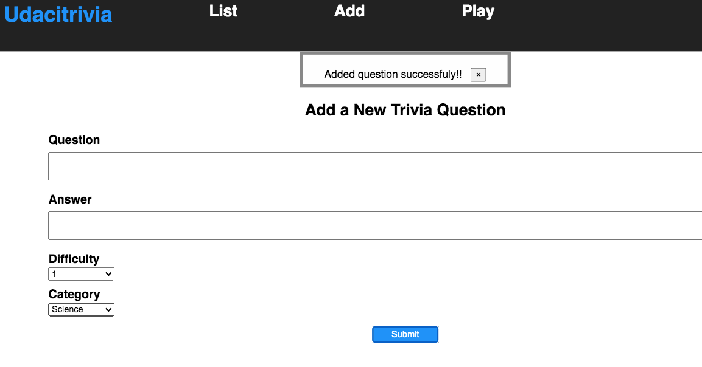

# Full Stack Trivia API  Frontend

## Getting Setup

> _tip_: this frontend is designed to work with [Flask-based Backend](../backend). It is recommended you stand up the backend first, test using Postman or curl, update the endpoints in the frontend, and then the frontend should integrate smoothly.

### Installing Dependencies

#### Installing Node and NPM

This project depends on Nodejs and Node Package Manager (NPM). Before continuing, you must download and install Node (the download includes NPM) from [https://nodejs.com/en/download](https://nodejs.org/en/download/).

#### Installing project dependencies

This project uses NPM to manage software dependencies. NPM Relies on the package.json file located in the `frontend` directory of this repository. After cloning, open your terminal and run:

```bash
npm install
```

>_tip_: **npm i** is shorthand for **npm install**

## Required Tasks

## Running Your Frontend in Dev Mode

The frontend app was built using create-react-app. In order to run the app in development mode use ```npm start```. You can change the script in the ```package.json``` file. 

Open [http://localhost:3000](http://localhost:3000) to view it in the browser. The page will reload if you make edits.<br>

```bash
npm start
```

## Udacitrivia

Udacitrivia is a webpage to manage the trivia app and play the game

## List 

Trivia App Home page includes questions of 6 different category, 
- We can view questions based on category. For each question Clicking on "Show Answer" will show the answer for the respective question, and you can hide the same by clicking on "Hide Answer"
- Pagination is allowed and each page has 10 questions.
- We can delete questions by clicking on the trash icon that is present in every question block
- Users will be able to search for questions based on the search term provided in the "Search Box", 
    - Partial search is enabled where user can look for a specific substring in the question
    - Search is case-insensitive

  
  

## Add

In this page user can add new questions, answers and associate the same with category and Difficulty level.

Upon successful adding a new question, Success message will be displayed as shown in the image

  
  

## Play

In this page, User can play a game picking the category

  

When a category is choosen, Questions related to those category will be picked randomly from database and displayed. Upon answering the questions, next random question of the same category will be picked and dispalyed

  

A total of 5 question will be picked and the score is calculated out of 5. The Game can be repeted by clicking on "Play Again?"

  